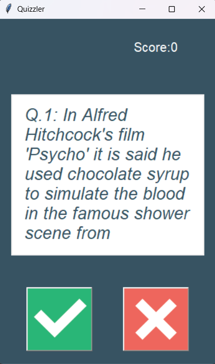
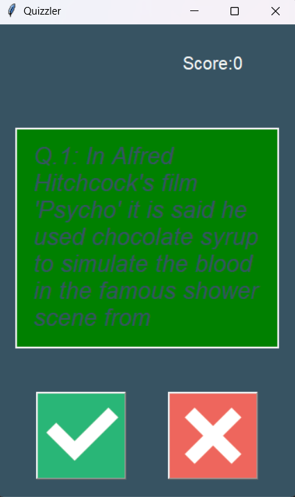
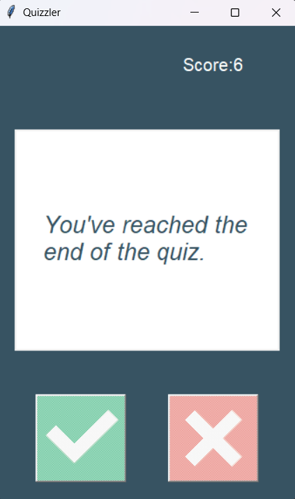

# quizzler-api
A Python-based quiz application that fetches trivia questions from a public API and provides an interactive True/False quiz experience through a Tkinter graphical interface.

---

## Features

- Fetches live quiz questions from the Open Trivia Database API
- Interactive True/False quiz interface
- Real-time score tracking
- Instant visual feedback for correct and incorrect answers
- Automatic question progression
- Handles HTML encoded characters in questions
- Clean Object-Oriented Programming (OOP) architecture

---

## Technologies Used

- Python
- Tkinter
- Requests
- JSON
- REST API
- Object-Oriented Programming (OOP)

---

## Project Structure

```text
quizzler-api/
│
├── main.py
├── data.py
├── quiz_brain.py
├── question_model.py
├── ui.py
├── images/
│   ├── true.png
│   └── false.png
├── screenshots/
├── README.md
├── requirements.txt
├── .gitignore
└── LICENSE
```

---

## Installation

Clone the repository:

```bash
git clone https://github.com/yourusername/quizzler-api.git
```

Navigate to the project folder:

```bash
cd quizzler-api
```

Install the required package:

```bash
pip install -r requirements.txt
```

Run the application:

```bash
python main.py
```

---

## Screenshots

### Quiz Interface



### Correct Answer Feedback



### Quiz Completed



---

## How It Works

1. Sends a request to the Open Trivia Database API.
2. Retrieves 10 True/False trivia questions in JSON format.
3. Converts the JSON response into Python objects.
4. Displays questions through a Tkinter graphical interface.
5. Checks the user's answers and updates the score.
6. Displays the final score after all questions have been answered.

---

## API Used

Open Trivia Database (OpenTDB)

https://opentdb.com/

---

## Future Improvements

- Multiple difficulty levels
- Question categories
- Multiple-choice questions
- Timer for each question
- High score tracking
- Custom number of questions
- Difficulty and category selection
- Online leaderboard

---

## License

This project is licensed under the MIT License.
